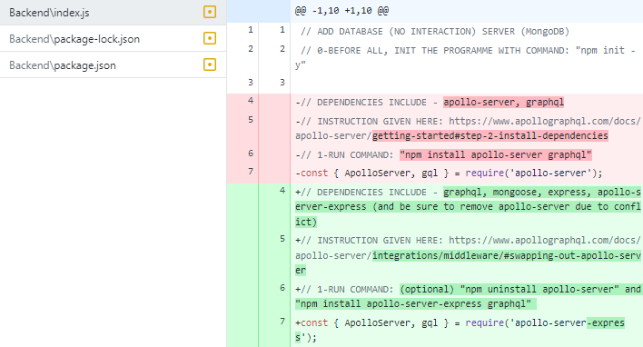
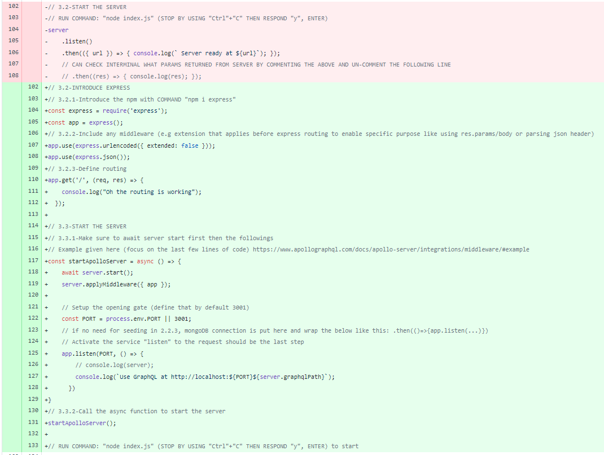
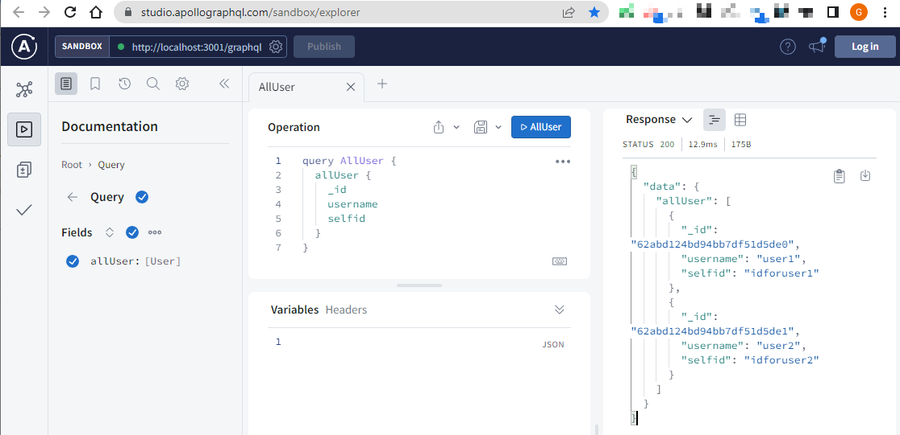
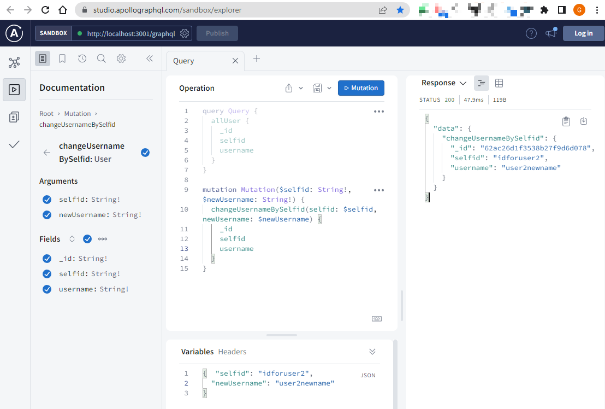

  # Apollo-Server-Express-Template (MongoDB & Express)

  *Note that: <strong>apollo-server is not compatible with apollo-server-express</strong>

  Feature 1: <br>
  MongoDB connected, so that data are saved to and re-called from the cloud database(alais "DB") server <br>
  Feature 2: <br>
  Express oriented - which means use <strong>express npm package</strong> plus <strong>apollo-server-express</strong> (additional freedom in self defining some connection configuration) <br>

  ## Table of Contents

  ***

  * [Screenshot](#screenshot)
  * [Installation](#installation)
  * [Usage](#usage)
  * [License](#license)
  * [Contributing](#contributing)
  * [Questions](#questions)

  ***

  ## Screenshot

  [Check out the content](https://github.com/Hongnodie/Apollo-Server-Client-Template/tree/MongoDB-Cloud-%26-Express-(npm))

  <p align="center">
    
  </p>

  <p align="center">
    
  </p>

  <p align="center">
    
  </p>

  <p align="center">
    
  </p>
  
  [See basic apollo code package at Github](https://github.com/Hongnodie/Apollo-Server-Client-Template.git)
  ## Installation

  All necessary code are in a single file: "Backend" Folder "index.js" file [Go to index.js](https://github.com/Hongnodie/Apollo-Server-Client-Template/blob/MongoDB-Cloud-%26-Express-(npm)/Backend/index.js)

  All commands to run in the terminal (or alias "Shell") are summed up here

  ```
  npm install apollo-server-express graphql mongoose express
  node index.js
  ```

  ## Usage

  <details>
  <summary>All included documentation</summary>
  <br>

  Check out package difference-(https://www.apollographql.com/docs/apollo-server/integrations/middleware)

  Apollo Server Express Quick Start-(https://www.apollographql.com/docs/apollo-server/integrations/middleware#apollo-server-express) - Switch from "apollo server" to "apollo-server-express"

  MongoDB Server-(https://cloud.mongodb.com/) - This is where data are saved and checked

  Mongoose npm package-(https://mongoosejs.com/docs/index.html) - the tool to utilize mongoDB cloud server

  Quick start for express-(http://expressjs.com/en/starter/hello-world.html) - All basic component you need to know are well confined here

  </details>
  
  ## License
  <details>
  
  <summary>MIT License</summary>
  <br>

  Copyright (c) [2022] [Hongnodie]
  > 
  > __Permission is hereby granted, free of charge, to any person obtaining a copy__
  > __of this software and associated documentation files (the "Software"), to deal__
  > __in the Software without restriction, including without limitation the rights__
  > __to use, copy, modify, merge, publish, distribute, sublicense, and/or sell__
  > __copies of the Software, and to permit persons to whom the Software is__
  > __furnished to do so, subject to the following conditions:__
  > 
  > The above copyright notice and this permission notice shall be included in all
  > copies or substantial portions of the Software.
  > 
  > THE SOFTWARE IS PROVIDED "AS IS", WITHOUT WARRANTY OF ANY KIND, EXPRESS OR
  > IMPLIED, INCLUDING BUT NOT LIMITED TO THE WARRANTIES OF MERCHANTABILITY,
  > FITNESS FOR A PARTICULAR PURPOSE AND NONINFRINGEMENT. IN NO EVENT SHALL THE
  > AUTHORS OR COPYRIGHT HOLDERS BE LIABLE FOR ANY CLAIM, DAMAGES OR OTHER
  > LIABILITY, WHETHER IN AN ACTION OF CONTRACT, TORT OR OTHERWISE, ARISING FROM,
  > OUT OF OR IN CONNECTION WITH THE SOFTWARE OR THE USE OR OTHER DEALINGS IN THE
  > SOFTWARE.    
  </details>

  ## Contributing

  This is built by Hongnodie. 
  
  ## Questions?

  If you have any questions about the project you can reach out to me via email or GitHub with the information below. 

  >Email  : 92ganhong@gmail.com 

  >GitHub : [Hongnodie](https://github.com/Hongnodie)